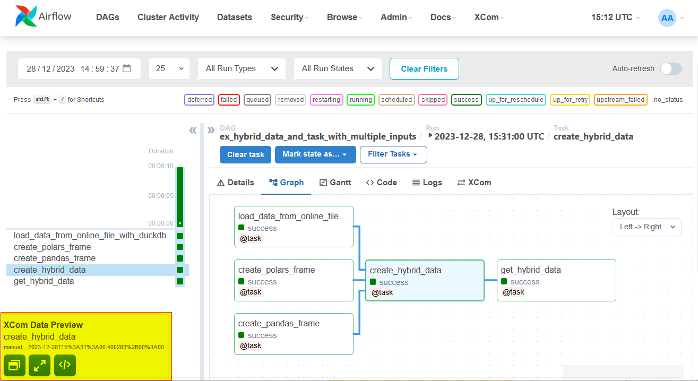
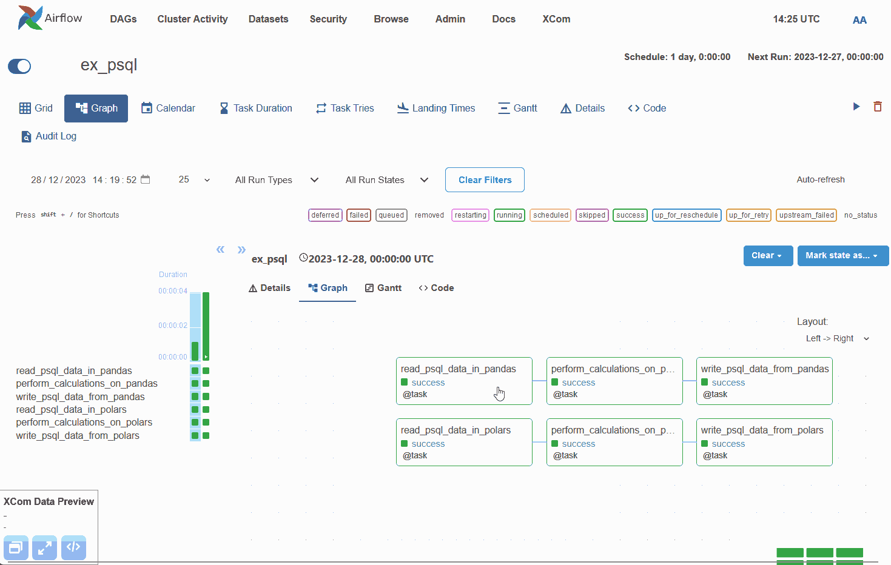
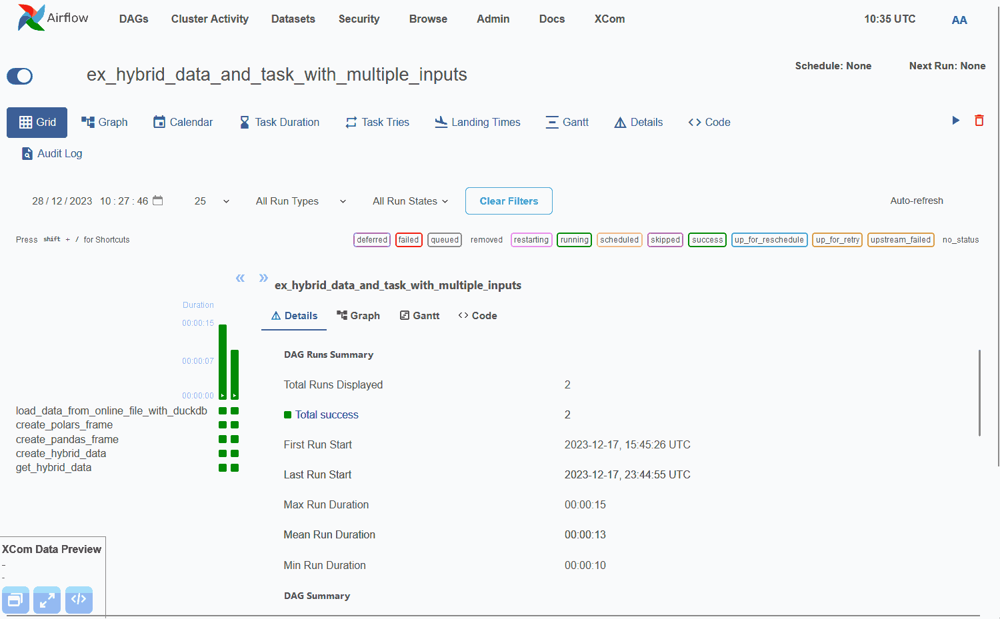
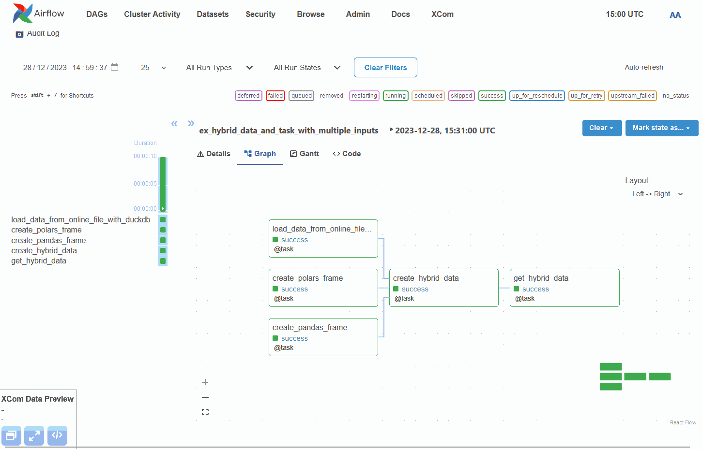
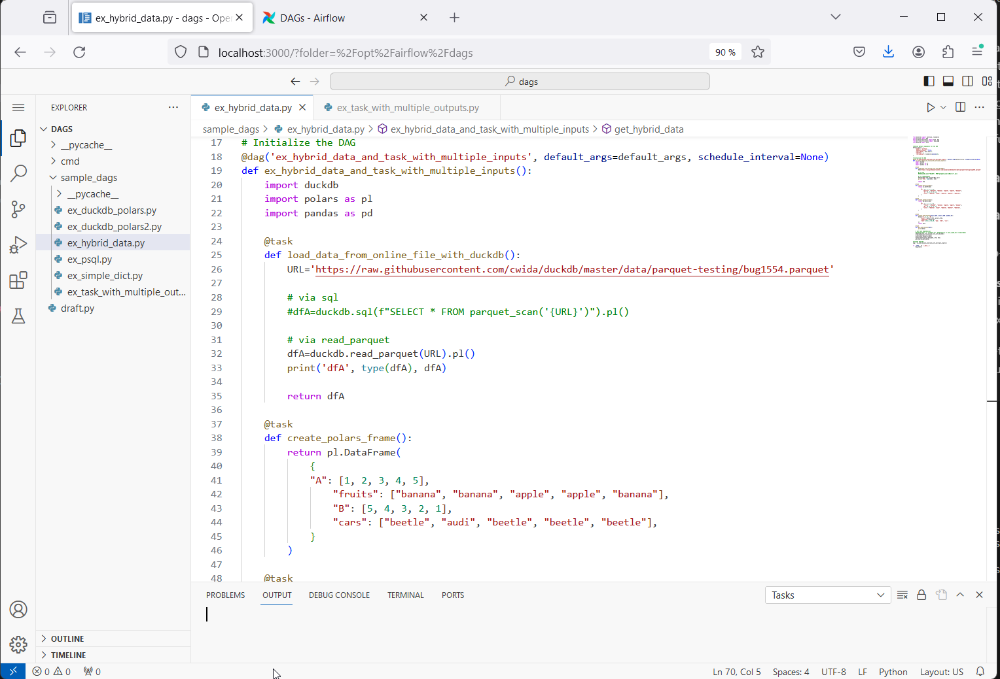

# Polars-Airflow

Lightweight open-source solution combining Airflow + Polars + OpenVSCode to develop robust Data Pipelines on inexpensive infrastructures.

## Context

For a better understanding of the interest of this project, it seems useful to me to provide some background informations.

### Small / Big Data

A large number of technologies have been emerging in the data world for many years. Not all of them are suitable for all business types.
In particular, large companies generating huge quantities of data (Big Data) must be able to arm themselves with a highly scalable technical ecosystem, which has the downside of being costly in terms of infrastructure but also maintenance and expertise.

However, following trends, it can quickly become counterproductive for moderately sized companies – generating large but reasonable quantities of data – to surround themselves with the same potentially overscaled technologies. **The over-calibration of the technical ecosystem of companies processing moderate data** (Small Data / Mid Data) **is a common problem which represents a very significant cost for companies which are sometimes poorly supported in their "digital weaponry"**.

### Mid Data Processing

On the Data Processing aspects, new technologies that are still quite recent are changing the way of designing data infrastructures (Datalab, ETL, etc.) by taking the part of **maximizing single node server resources exploitation** : offering maximum execution capacity, with a minimum of infrastructure.

*Examples : [Polars](https://github.com/pola-rs/polars), [DuckDB](https://github.com/duckdb/duckdb), ...*

These technologies lead us to reconsider the infrastructures for many companies halfway between Big Data and Small Data: Mid Data.

From a Data Engineer perspective, here are the main alternatives currently available to ensure Data Processing :

| Alternative  | Interest |
| ----- |  ----- |  
| **Pandas** | Single-Node Server <br> 💲👷<br>💲💻<br>✅ Easy to install <br> ❌ Only for Small Data |
| **Self-hosted Spark** | Cluster-based <br> 💲💲💲👷<br>💲💲💻<br>✅ Big Data <br> ❌ High human cost |
| **Self-managed Spark** <br>(Databricks, Synapse, etc.) | Cluster-based <br> 💲💲👷<br>💲💲💲💻<br>✅ Big Data <br> ❌ High solution cost 
| **Other self-managed solutions** <br>(Snowflake, etc.) | 💲💲👷<br>💲💲💲💻<br>✅ Big Data <br> ❌ High solution cost 
| **Polars / DuckDB** | Single-Node Server <br>💲👷<br>💲💻<br>✅ Mid Data <br> ✅ Cheap & Easy

In general, we note that the majority of scalable solutions are expensives in terms of expertise and human time (to install and maintain) and/or technical pricing.

Currently, it seems obvious that **technologies like Polars and DuckDB have a very important place to take in the Data market**, to meet a real need for “Mid Data Processing”.

### Mid Data Orchestration

There are a large number of orchestration technologies that can be used in a Data context ([Luigi](https://github.com/spotify/luigi), [dagster](https://github.com/dagster-io/dagster), [Prefect](https://github.com/PrefectHQ/prefect), [Mage-ai](https://github.com/mage-ai/mage-ai), [Kestra](https://kestra.io/), etc.).

However, it seems accepted that the most popular choice (and therefore benefiting from the greatest number of documented resources) is Airflow. At present, not all of them are **natively** fully compatible with technologies like Polars (this is particularly the case for Airflow).

Airflow solution has many advantages, but also some disadvantages which, fortunately, can be overcome through prior work (the result of which is this project).
- ✅ Well-designed task-based python framework for orchestration
- ✅ Provide friendly user interface
- ✅ Very high orchestration flexibility
- ✅ Can execute Python code, but also make use of a large number of Operators.
- ❌ Can be complex to provision and maintain. This is particularly the case for cluster-based typologies, which is once again not necessarily suited to moderate-sized companies.
It can therefore represents a significant cost (human and technical) for setting up the cluster and maintaining it in operational condition.
- ✅ For medium-sized structures : can be easily deployed in single node mode.
- ❌ The embedded XCom Backend in Airflow (used to transfer data from one task to another) is not natively compatible with polars (or even pandas).
- ❌ The embedded XCom Backend in Airflow can only handle low amount of data (in general metadata) and is not natively designed for Frame-like data (ex. pandas). The main current workaround is to manage the read/write of DataFrames in a dedicated storage, and only read/write in XCom the paths to this data. 

The present project offers a more abstract and less time-consuming alternatives to bypass the disadvantages above, keeping all the advantages.


## Polars + Airflow

### The Mid Data best compromise

In a few words, this project proposes a solution based on :

 >` Airflow (+ Custom Additional Layer)`<br>
 >`+ Polars + Duckdb + Pandas + ... (embedded)`<br>
 >`+ OpenVSCode (embedded)`

... all in a Docker Image deployable on a simple Single-Node Server

With additional minimal stuff :

 >`+ Internal Postgresql Database for Airflow`<br>
 >`+ Customizable Postgresql Database for your team`

### Advantages & drawbacks

**Advantages :**
- ⚡ Light solution : Single Node + Disk
- 💲 Low infrastructure Cost
- 👷 Low Human Cost, easy to maintain
- 💥 Can handle Mid/~Big Data easily
- 👬 Airflow-based : widely used by the community
- ✨ Easy installation with Docker : can be installed on any Linux Host with Docker engine
- ✈️ Easy deployment & alignment DEV / UAT / PROD (one unique Docker Image)

**Some drawbacks :**
- Not fully adapted to Big Data. But can in theory process very large volumes of data thanks to Polars' Lazy features, in return for a longer execution time.
- May require additional organization to avoid concurrent execution of several greedy pipelines, with only one node available, for example by spreading out the executions over time. However, in the majority of cases this does not pose a particular problem in terms of business processes, and teams benefit more from keeping their infrastructure simple, robust and inexpensive, even if this causes additional processing time.

### Features

| Feature  | Details |
| ----- |  ----- |  
| 📶 **Compatibility with recent Python Data Packages** | Polars, Pandas, Duckdb, Scikitlearn, ... |
| 💾  **Custom Serializer** for XCom Backend | All frame-based Data variables are natively fully compatibles with XCom thanks to the [Embedded Custom Data Serializer](#embedded-custom-data-serializer) |
| 📺 **XCom Data Viewer** | You can easily view XCom real data from Webui, via the [Embedded Tree-Based Data Viewer](#embedded-xcom-data-viewer) |
| 🔍 **XCom Data Inspection** | You can easily inspect XCom real data from Webui, see [Embedded Data Inspection](#embedded-xcom-data-inspection) |
| 📱 **Customizable** | You can install any package you need from a custom Dockerfile |
| 🚧 **OpenVSCode** | Easy [OpenVSCode startup](#openvscode-ready-to-use) over existing image, with easy access to workspaces and main extensions | 
| 📘 **Notebooks** | You can easily develop prototypes into embedded OpenVSCode Notebooks | 
| 🔨 **2 already prepared workspaces** | - Core : where you can develop sharable modules, natively usable from any Airflow DAG<br> - Dag : where you can develop dags<br> Both workspaces are preset in order to auto-connect to embedded Python kernel and for Pytest usage | 
| ⚓ **Some operational scripts** | Provide (in DAG workspace from OpenVSCode) multiple scripts for frequently used tasks like Refresh DAGS Trigerring | 
| 💊 **Easy connections set up** | Provide a customizable script to declare sharable connections at start up, making them viewable from Webui | 

### How to install

0. Install docker + docker compose
1. Clone repository
2. Change properties in .env file if needed (you may need to change HOST_UID and HOST_GID to match yours)
3. Use [4-steps scripts](#4-steps-scripts) for solution management

### 4-steps scripts

Four usual scripts are provided to allow easy prepare/startup/stop/clean the environment.

| Script  | Usage |
| ----- |  ----- |  
| **00_init.sh** | Create all volumes folder that you need, and apply right permission policy |
| **01_install.sh** | Start/install docker apps | 
| **02_uninstall.sh** | Stop/uninstall docker apps <br>💾 Volumes folder data are not lost (persistent volumes) | 
| **03_clean_all.sh** | Clean all volumes folders <br>⚠️ All data will be lost |

Once your solution is running, you will use most of the time **01_install.sh** and **02_uninstall.sh** scripts.

### Main python packages provided

Polars-Airflow docker image size is ~1Go (for last version), it includes all main data-processing python packages with following versions :
```
duckdb                                   0.9.2
numpy                                    1.24.4
pandas                                   2.1.4
pandas-gbq                               0.20.0
polars                                   0.20.2
pyarrow                                  14.0.2
pyarrow-hotfix                           0.6
scikit-learn                             1.3.2
SQLAlchemy                               1.4.50
```

You can install any custom packages by creating your own docker image inheriting from **qremplak/polars-airflow**.

### Focus on Airflow Custom Additional Layer

As explained in [context about data orchestration](#mid-data-orchestration), Airflow admits a certain number of disadvantages in a Data-oriented context of use.
Through this project, several issues were addressed by implementing a custom overlay to the Airflow project.

Below are described each of the main additionnal custom features that have been embedded in Airflow.

These features were developed using the [standard plugin system](https://airflow.apache.org/docs/apache-airflow/stable/authoring-and-scheduling/plugins.html) provided by Airflow, supplemented by the use of a [pattern patching system](https://github.com/qremplak/pattern_patching/tree/main) which allowed careful alteration of the web interface to add a Custom Panel at DAG Grid View.



#### Embedded XCom Data Viewer

Thanks to [Embedded Custom Data Serializer](#embedded-custom-data-serializer), the temporary output data of each task execution is easily viewable from Webui.



⚠️ Limits :
- You can only view a subset of the data. If you need a in-depth inspection, please see the [Embedded XCom Data Inspection](#embedded-xcom-data-inspection)


#### Embedded Custom Data Serializer

The custom XCom Backend provided is based on a custom [Smart Serializer](https://github.com/qremplak/SmartPyDumper) that can serialize and de-serialize any json-like data that can contains any combination of Frame-like Data (Pandas DataFrames, Series, Polars DataFrame, LazyFrames, etc).



⚠️ Limits : 
- This serializer is not natively designed to handle kind of variable that are not common use in a Data Engineering content. It's a robust serializer specialized in Data Engineering use cases.
- Frame-like variables that containing complex data at cell-level may be not fully compatibles. 

#### Embedded XCom Data Inspection

You can click to the Inspect Button of the additional panel to open the Data into OpenVSCode and proceed to in-depth inspection if needed :


#### OpenVSCode ready-to-use

You can use **activate_openvscode.sh** to start OpenVSCode server directly into *Airflow Scheduler* container (the one used to execute flows).


OpenVSCode is installed on-the-fly into already running Airflow container, and not during Docker Image building, for multiple reasons :
- In an unique Airflow environment, multiple containers are deployed, based on the same image. OpenVSCode is just useful for one of theme. So it's better to install it only once to avoid unnecessary disk and memory usage on the single-node server.
- In practice, OpenVSCode should be used only in DEV environment, not UAT and PROD. On-the-fly installation allow the flexibility/security to activate Code Editor only if needed.

## TODO 

- Improve default [ADBC engine](https://pola-rs.github.io/polars/user-guide/io/database/#engines) usage for Polars database reading/writing using Airflow Postgres Hooks (faster than SQLAlchemy, but for now only available for Postgres & SQLite). Maybe implement a custom Hook ?
- Improve [XCom Data Viewer](#embedded-xcom-data-viewer) rendering, in particular by adapting panel size to content.
- Make XCom Frame-like Data Viewer ajax-based, to allow direct-filtering from local backup files.
- Adding default XCom Data Purge DAG : simple DAG which removes all XCom backup Data that may be obsolete.
- Provide Helm chart for easy multi-server Airflow :
    - Each data processing engine will stay single-node (keeping it simple)
    - But there will be multiple data processing engines, 